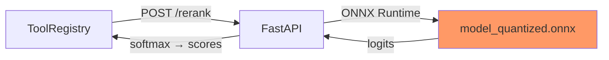

# Fashion Shop — Agentic RAG Chatbot

[](https://docs.docker.com)
[](https://php.net)
[](https://mariadb.org)
[](https://deepseek.com)
[](https://github.com/AE-AI-HIT15/Project---HIT_Python/actions/workflows/ci.yml)

**Production-grade AI shopping assistant** — Agentic RAG with DeepSeek LLM, function calling, ONNX cross-encoder reranker, multi-tier cache, and CI/CD pipeline.

---

## Table of Contents

- [Overview](#overview)
- [Architecture](#architecture)
- [Chatbot Engine](#chatbot-engine)
- [Quick Start](#quick-start)
- [Configuration](#configuration)
- [API Reference](#api-reference)
- [Testing](#testing)
- [CI/CD Pipeline](#cicd-pipeline)
- [Performance Optimization](#performance-optimization)
- [Security](#security)
- [Project Structure](#project-structure)

---

## Overview

| Layer | Technology | Purpose |
|---|---|---|
| **LLM** | DeepSeek (API) | Natural language understanding, tool orchestration |
| **Reranker** | ONNX Runtime (int8) | Cross-encoder relevance scoring, < 500 MB |
| **Search** | MariaDB FULLTEXT + LIKE | Hybrid Vietnamese text search |
| **Cache** | File-based | Multi-TTL (5 min → 24 h) |
| **Fallback** | Rule-based engine | Zero-dependency intent classification |
| **CI/CD** | GitHub Actions | Quality → Test → Security → Docker → Deploy |

### Core Principles (SOLID)

- **Single Responsibility**: Each component has one job. `AgenticOrchestrator` orchestrates; `ToolRegistry` executes; `ChatbotEngine` falls back.
- **Open/Closed**: New tools register via `ToolRegistry::registerAll()` — no core changes needed.
- **Liskov Substitution**: `LLMFactory::fromEnv()` returns any provider implementing `LLMProvider` interface.
- **Interface Segregation**: Cache, DB, and LLM interfaces are minimal and focused.
- **Dependency Inversion**: High-level logic depends on abstractions (`LLMProvider`, `PDO`), not concretions.

---

## Architecture

```
┌──────────────────────────────────────────────────────────────┐
│                     Browser (Chat Widget)                     │
│               includes/chatbox.js — fetch-based               │
└────────────────────────┬─────────────────────────────────────┘
                         │ POST /api/chatbot { message }
                         ▼
┌──────────────────────────────────────────────────────────────┐
│                    AgenticOrchestrator (PHP 8.2)              │
│                                                              │
│  1. loadHistory() → last 20 messages from DB                 │
│  2. LLM.chat(messages, tools) → function-calling loop        │
│     ├── search_products  → FULLTEXT + LIKE query             │
│     │   └── Reranker (ONNX) → cross-encoder relevance sort   │
│     ├── suggest_size     → AI size recommendation            │
│     ├── get_outfit       → outfit pairing engine             │
│     ├── get_faq          → policy lookup                     │
│     ├── get_product_detail → full product info              │
│     └── get_categories   → category tree                     │
│  3. harvestProducts() → extract structured product cards     │
│  4. saveMessages() → persist to DB                           │
│                                                              │
│  Fallback: ChatbotEngine (rule-based, no LLM needed)         │
└────────────────────────┬─────────────────────────────────────┘
                         │ internal HTTP (PHP→PHP, port 80)
                         ▼
┌──────────────────────────────────────────────────────────────┐
│                    Internal API Layer                         │
│                                                              │
│  /api/products?search=&category=&min_price=&max_price=        │
│  /api/products/{id}                                          │
│  /api/products/{id}/sizes                                    │
│  /api/faq?q=                                                  │
│  /api/outfit?product_id=                                     │
└──────────────────────────────────────────────────────────────┘
                         │ Docker Compose
                         ▼
┌──────────┐  ┌──────────┐  ┌──────────────┐  ┌──────────────┐
│  App     │  │  DB      │  │  Reranker    │  │  phpMyAdmin  │
│  :8090   │  │  :3308   │  │  :8001       │  │  :8091       │
│  PHP 8.2 │  │ MariaDB  │  │ ONNX Runtime │  │  (tools)     │
└──────────┘  └──────────┘  └──────────────┘  └──────────────┘
```

### Reranker Sidecar



- **Model**: `BAAI/bge-reranker-v2-m3` → ONNX int8 dynamic quantization
- **Image size**: ~500 MB (vs 1.8 GB with PyTorch)
- **Latency**: ~50–300 ms per batch (CPU, 20 items)
- **Fallback**: Jaccard keyword overlap if model not ready

---

## Chatbot Engine

### Agentic Loop

```
User: "áo khoác dưới 500k"

1. LLM → function_call: search_products(search="áo khoác", max_price=500000)
2. ToolRegistry → SQL: SELECT ... WHERE MATCH(name) AGAINST('+khoác*') OR name LIKE '%áo khoác%' AND price <= 500000
3. Reranker → scores: [0.97, 0.82, 0.45, ...] → reorder by relevance
4. LLM → "Mình có 3 áo khoác dưới 500k..."
5. harvestProducts() → [{ id: 10, name: "Áo khoác bomber", ... }]
6. saveMessages() → DB

Response: { message: "...", products: [...], session_token: "..." }
```

### System Prompt (10 Rules)

| # | Rule | Example |
|---|---|---|
| 1 | **Precise keyword extraction** | `"áo khoác"` → search=áo khoác, NOT search=áo |
| 2 | **Show ALL results** | No limit — every matching product |
| 3 | **Ask for clarification** | `"giới thiệu áo"` → "bạn cần áo phong cách gì?" |
| 4 | **Fresh search each turn** | Never reuse history results |
| 5 | **Tool calling mandatory** | No guessing — always call tools |
| 6–9 | Size, outfit, FAQ, orders | Appropriate tool routing |
| 10 | **Product links with IDs** | `product.php?id=XX` format |

### Fallback Engine (Zero LLM)

When LLM is unavailable, `ChatbotEngine` handles:

- **13 intents**: greeting, product_search, size_advice, outfit, FAQ (7 topics), cart, order, help, bye, unknown
- **Keyword extraction**: longest-match for Vietnamese compound words (`"áo sơ mi caro"` → `search=áo sơ mi`)
- **Direct DB queries**: no API calls needed

### Caching Strategy

| Cache | Key | TTL | Invalidation |
|---|---|---|---|
| Search results | `sp\|{hash}` | 5 min | Time-based |
| Product detail | `pd\|{id}` | 5 min | Time-based |
| Size guide | `sg\|{hash}` | 10 min | Time-based |
| FAQ | `faq\|{hash}` | 1 h | Time-based |
| Outfit | `of\|{hash}` | 10 min | Time-based |
| Categories | `categories` | 24 h | Time-based |

Atomic writes (`temp → rename`), sub-directory sharding, automatic cleanup.

### Chat History

```sql
-- Sessions
chat_sessions (id, user_id, session_token, status, created_at, updated_at)
-- Messages with product metadata
chat_messages (id, session_id, role, message, metadata JSON, created_at)
-- Tool execution logging
tool_executions (id, session_id, tool_name, arguments, result, duration_ms, success)
```

---

## Quick Start

### Prerequisites

- Docker 24+ & Docker Compose
- DeepSeek API key (get at [platform.deepseek.com](https://platform.deepseek.com))

### Local Development

```bash
# 1. Set up environment
cp .env.example .env
# Edit .env: add LLM_API_KEY=your-deepseek-key

# 2. Start all services
docker compose up -d --build

# 3. Verify
curl http://localhost:8090/api/products?limit=1

# 4. Chat with the bot
curl -X POST http://localhost:8090/api/chatbot \
  -H "Content-Type: application/json" \
  -d '{"message": "áo khoác dưới 500k"}'

# 5. View logs
docker compose logs -f app
docker compose logs -f reranker
```

### Manual Testing (no LLM)

```bash
# Force fallback engine by setting invalid API key
LLM_API_KEY=invalid docker compose up -d app
curl -X POST http://localhost:8090/api/chatbot \
  -H "Content-Type: application/json" \
  -d '{"message": "áo thun trắng"}'
```

### Reranker Only

```bash
# Build + test the reranker independently
docker build -t reranker-test docker/reranker/
docker run -d -p 8001:8000 reranker-test

# Wait for model to load (~60s cold start)
curl http://localhost:8001/health

# Test reranking
curl -X POST http://localhost:8001/rerank \
  -H "Content-Type: application/json" \
  -d '{"query":"áo khoác","texts":["Áo khoác bomber","Áo thun trắng","Áo khoác jean"]}'
```

---

## Configuration

### Environment Variables

| Variable | Required | Default | Description |
|---|---|---|---|
| `LLM_API_KEY` | ✅ | — | DeepSeek API key |
| `LLM_PROVIDER` | — | `deepseek` | LLM provider name |
| `LLM_MODEL` | — | `deepseek-chat` | Model name |
| `LLM_BASE_URL` | — | `https://api.deepseek.com` | API base URL |
| `LLM_TIMEOUT` | — | `60` | API timeout (seconds) |
| `DB_HOST` | — | `localhost` | Database host |
| `DB_NAME` | — | `shop_db` | Database name |
| `DB_USER` | — | `shop_user` | Database user |
| `DB_PASS` | — | `shop_pass` | Database password |
| `MARIADB_ROOT_PASSWORD` | ✅ | — | MariaDB root password |
| `RERANKER_URL` | — | `http://reranker:8000` | Reranker sidecar URL |
| `ADMIN_EMAIL` | — | `admin@shop.com` | Auto-created admin |
| `ADMIN_PASSWORD` | — | (random) | Auto-created admin password |

### Docker Compose Profiles

```bash
# Minimal: app + db only (no reranker)
docker compose up -d --profile minimal app db

# Full stack (default)
docker compose up -d

# With database admin
docker compose --profile tools up -d
```

---

## API Reference

### Chatbot

```http
POST /api/chatbot
Authorization: Bearer <token>  # optional
Content-Type: application/json

{
  "message": "áo khoác dưới 500k",
  "session_token": "abc123"  # optional, for continuing conversations
}

→ 200 OK
{
  "message": "Mình có 3 áo khoác dưới 500k...",
  "products": [
    {
      "id": 10,
      "name": "Áo khoác bomber",
      "price": 450000,
      "stock": 12,
      "image": "bomber.jpg",
      "image_url": "http://.../images/bomber.jpg",
      "url": "http://.../product.php?id=10"
    }
  ],
  "session_token": "xyz789",
  "session_id": 42
}
```

```http
GET /api/chatbot/history
Authorization: Bearer <token>

→ 200 OK
{
  "messages": [
    { "role": "user", "message": "áo khoác dưới 500k", "created_at": "..." },
    { "role": "assistant", "message": "Mình có...", "metadata": {...}, "created_at": "..." }
  ],
  "session_token": "...",
  "session_id": 42
}
```

### Products

```http
GET /api/products?search=áo khoác&max_price=500000&limit=20
GET /api/products/10
GET /api/products/10/sizes
GET /api/products/10/reviews
POST /api/products/10/reviews  { "rating": 5, "comment": "..." }
```

### Errors

All endpoints return consistent error format:

```json
{
  "error": "Error description",
  "code": 400
}
```

Error codes: `400` (validation), `401` (auth), `404` (not found), `429` (rate limit), `500` (server error).

---

## Testing

```bash
# Unit tests (no DB needed — uses SQLite)
composer install
vendor/bin/phpunit --testsuite=Unit --colors=always

# Integration tests (requires MariaDB)
vendor/bin/phpunit --testsuite=Integration --colors=always

# Run with coverage
vendor/bin/phpunit --coverage-html reports/coverage/
```

Test structure:

| Suite | Tests | DB | Speed |
|---|---|---|---|
| Unit (Cache, ToolRegistry) | 42 tests, 66 assertions | SQLite fallback | ~2s |
| Integration (API, Chatbot) | 12 tests | MariaDB service | ~15s |

---

## CI/CD Pipeline

```
push → Code Quality → Unit Tests → Integration Tests → Security → Docker Build → Deploy 🚀
```

| Job | Tools | When |
|---|---|---|
| `code-quality` | PHP lint, PHPCS PSR-12, Python lint | Every push |
| `unit-tests` | PHPUnit (SQLite) | Every push |
| `integration-tests` | PHPUnit + MariaDB service | Every push |
| `security` | Secret scanner, Trivy | Every push |
| `docker` | Build app + reranker, Trivy scan | Every push |
| `deploy` | SSH → git pull → docker compose up | main/master only |

### Deploy Flow

```
1. SSH into production server
2. docker system prune -af (free disk)
3. git pull + reset --hard
4. Write .env from secrets
5. docker compose build
6. docker compose up -d
7. Healthcheck: /api/products?limit=1 (120s timeout)
8. docker image prune -f
```

### Required Secrets

| Secret | Purpose |
|---|---|
| `DEPLOY_HOST` | Server IP/hostname |
| `DEPLOY_USER` | SSH user |
| `DEPLOY_SSH_KEY` | SSH private key |
| `DEPLOY_KNOWN_HOSTS` | SSH known hosts |
| `DEPLOY_PATH` | Server path to repo |
| `DEPLOY_GITHUB_TOKEN` | PAT with repo access |
| `LLM_API_KEY` | DeepSeek API key |
| `MARIADB_ROOT_PASSWORD` | DB root password |
| `DB_PASS` | DB user password |

---

## Performance Optimization

### Database Indexing

```sql
-- FULLTEXT for Vietnamese search
ALTER TABLE products ADD FULLTEXT INDEX ft_products_name (name);
-- Composite for category + price filtering
ALTER TABLE products ADD INDEX idx_category_price (category_id, price);
-- Session + message lookup
ALTER TABLE chat_messages ADD INDEX idx_session_created (session_id, created_at);
```

### Caching

- **File-based**: `/tmp/shop_cache/{shard}/{hash}.cache` — atomic writes, TTL-based
- **Hit rate goal**: > 80% for FAQ, categories; > 60% for product search
- **Monitoring**: Count cached files via `ls /tmp/shop_cache/*/* | wc -l`

### Reranker Optimization

| Factor | Optimization |
|---|---|
| Model size | ONNX int8 quantization → ~400 MB |
| Inference | ONNX Runtime CPUExecutionProvider |
| Threading | `intra_op_num_threads=2` (balance) |
| Batch limit | Rerank max 20 items per call |
| Timeout | 2s HTTP timeout → fallback to SQL order |

### Security

- **No hardcoded secrets**: All credentials via environment (`.env` gitignored)
- **Admin auth**: DB-backed `password_verify()` + env fallback
- **CORS**: Restricted to same-origin
- **SQL injection**: Prepared statements everywhere (`PDO::prepare`)
- **XSS**: Output escaping (`htmlspecialchars`)
- **Rate limiting**: nginx/apache config (optional)

---

## Project Structure

```
├── api/
│   ├── cache/          # File-based Cache class
│   ├── controllers/
│   │   ├── auth/       # Login, register, profile
│   │   ├── chatbot/    # Core engine
│   │   │   ├── AgenticOrchestrator.php
│   │   │   ├── ToolRegistry.php        # 6 tools + reranker integration
│   │   │   ├── engine.php              # Rule-based fallback
│   │   │   └── llm/                    # LLM providers
│   │   └── products/   # Product CRUD, search, sizes, reviews
│   └── routes/         # API routing
├── docker/
│   ├── apache.conf
│   ├── mariadb-ft.cnf
│   ├── php.ini
│   └── reranker/       # ONNX cross-encoder sidecar
│       ├── Dockerfile  # Multi-stage, < 500 MB
│       ├── app.py
│       └── export_model.py
├── includes/           # Chat widget, DB helpers, HTML templates
├── sql/                # Schema + migrations
├── tests/              # PHPUnit tests (Unit + Integration)
├── knowledge/          # RAG knowledge base
├── images/             # Product images
├── .github/workflows/  # CI/CD pipeline
├── docker-compose.yml
├── Dockerfile
└── README.md
```

---

## License

MIT — see [LICENSE](LICENSE) for details.
