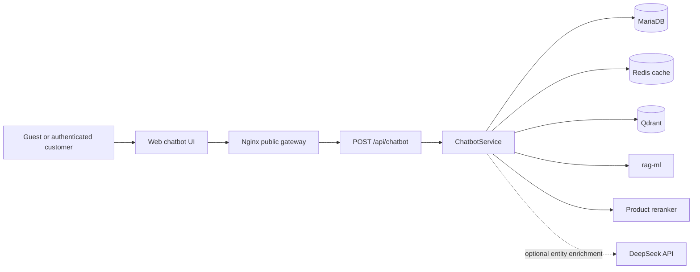
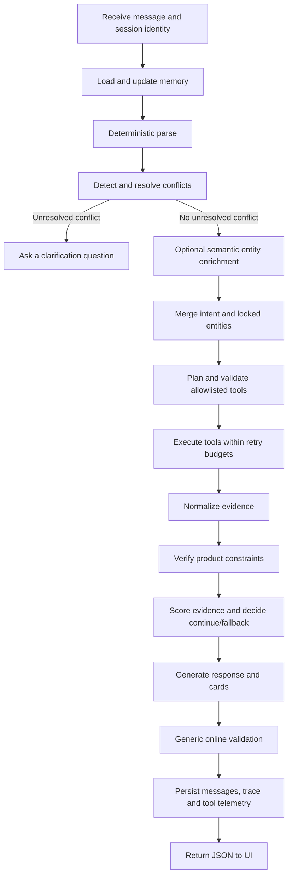
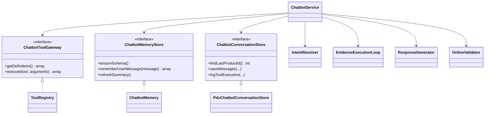
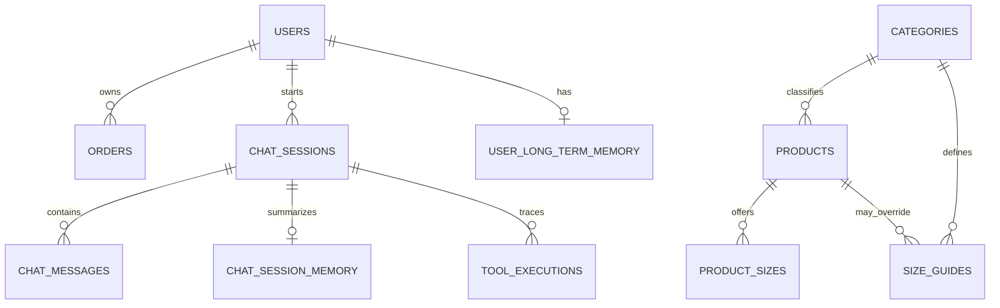

# Software Requirements Specification - Fashion Shop Chatbot

Document ID: `SRS-CHATBOT-001`  
Version: `1.0.0`  
Status: Draft for baseline approval  
Date: 2026-08-01  
Standard alignment: ISO/IEC/IEEE 29148:2018  
System version: Deterministic-first hybrid chatbot  

## Document Control

| Role | Responsibility |
|---|---|
| Product Owner | Approve scope, priorities, business rules and acceptance thresholds |
| Business Analyst/PM | Maintain requirements, quality attributes and traceability |
| Engineering | Implement requirements and preserve interface contracts |
| QA | Verify acceptance criteria and maintain test evidence |
| Operations | Operate Docker services, secrets, telemetry and recovery procedures |

| Version | Date | Change |
|---|---|---|
| 1.0.0 | 2026-08-01 | Replaced the legacy SRS; rebuilt requirements and traceability from the current production code |

This document is aligned with ISO/IEC/IEEE 29148:2018. It is not a claim of third-party certification.

## 1. Introduction

### 1.1 Purpose

This SRS defines the functional, interface, data, quality, constraint, verification and traceability requirements for the Fashion Shop chatbot. It is the baseline used by product, engineering, QA and operations to decide what the chatbot shall do and how conformance shall be demonstrated.

### 1.2 Scope

The chatbot shall support:

- Product search using structured constraints.
- Product detail lookup.
- Size advice from height and weight.
- Policy and shop-information answers grounded in the knowledge base.
- Mixed product and policy questions.
- Authenticated order-status lookup.
- Anonymous and authenticated conversation sessions.
- Deterministic guardrails for unsupported checkout and outfit-advice actions.
- Optional LLM entity enrichment that cannot choose tools or generate SQL.

The chatbot shall not:

- Add, update or remove cart items.
- Perform checkout or payment.
- Provide outfit advice in the current release.
- Expose another user's order data.
- Let an LLM generate SQL, select a production tool or overwrite deterministic locked fields.
- Expose private chain-of-thought.

### 1.3 Intended Audience

- Product Owner and project manager.
- Business analyst and requirements engineer.
- PHP, data and ML engineers.
- QA and security testers.
- DevOps and system operators.

### 1.4 References

- [ISO/IEC/IEEE 29148:2018 official ISO record](https://www.iso.org/standard/72089.html).
- [IEEE/ISO/IEC 29148-2018 active-standard record](https://standards.ieee.org/ieee/802.1Q/6937/).
- `README.md`.
- `docs/chatbot-spec.md`.
- `docs/technical-spec.md`.
- `sql/shop_db.sql`.
- `eval/chatbot_eval_cases.jsonl`.
- `tests/eval/rag_eval_cases.json`.

### 1.5 Terms and Abbreviations

| Term | Meaning |
|---|---|
| RAG | Retrieval-Augmented Generation; retrieval of shop knowledge before answering |
| LLM | Large Language Model; optional semantic entity enricher and offline evaluator |
| Entity | Structured value extracted from a query, such as color, size or maximum price |
| Intent | The primary operation requested by the user |
| Tool | Allowlisted PHP capability executed by `ToolRegistry` |
| Evidence | Normalized facts produced by tools and used to generate or verify a response |
| Card | Product data rendered by the chatbot UI |
| Guest | User without a valid bearer token |
| Authenticated user | User resolved from a valid API bearer token |
| p95 | 95th percentile latency |
| RAGAS | Offline framework used to measure response and context quality |
| RTM | Requirements Traceability Matrix |

## 2. System Overview

### 2.1 Product Perspective

The chatbot is part of a PHP fashion-commerce website. Nginx is the public gateway. The application container currently serves PHP through its web runtime. MariaDB stores business and conversation data, Redis provides cache, Qdrant stores knowledge vectors, `rag-ml` provides Vietnamese embeddings and knowledge reranking, and the optional DeepSeek integration enriches unresolved semantic entities.



### 2.2 System Objectives

- Return product results that satisfy all explicit user constraints.
- Answer policy questions only from retrieved shop evidence.
- Keep tool selection and data access deterministic and auditable.
- Preserve useful conversation context without leaking private order data.
- Degrade safely when optional LLM, vector or cache services are unavailable.

### 2.3 Operational Flow



### 2.4 Assumptions and Dependencies

- Product color, material, style and occasion are inferred from `products.name` and `products.description`; there are no dedicated V1 columns for these attributes.
- Product sizes are read from `product_sizes`.
- Size advice depends on rows in `size_guides`.
- Policy accuracy depends on the Markdown/FAQ knowledge content and its category metadata.
- Qdrant vectors and runtime query embeddings must use the same embedding model and dimension.
- A missing LLM credential shall not disable deterministic chatbot functions.

### 2.5 Logical Class Model



## 3. Stakeholders and User Classes

| Stakeholder/User class | Needs | Permissions |
|---|---|---|
| Guest customer | Search products, ask size/policy questions, continue an anonymous session | No private order access |
| Authenticated customer | Guest capabilities plus personal order lookup and persistent user memory | Access only to orders owned by the authenticated user |
| Product administrator | Maintain product, stock, category and size data through the shop administration system | No chatbot-specific tool-control privilege |
| Content/policy owner | Maintain policy, FAQ and shop-information content | Responsible for factual approval of knowledge content |
| QA engineer | Execute unit, integration, manual, RAGAS and network tests | Test data and non-production credentials only |
| System operator | Configure Docker, database, Qdrant, Redis, model services and secrets | Infrastructure access according to deployment policy |
| External LLM provider | Return optional structured entity enrichment and offline judge output | Receives only prompts sent by configured integration |

## 4. Use Cases

| ID | Name | Primary actor | Success result |
|---|---|---|---|
| UC-01 | Search products | Guest/customer | Only matching product cards are returned |
| UC-02 | View product detail | Guest/customer | Requested product ID and available attributes are returned |
| UC-03 | Request size advice | Guest/customer | A size is suggested from supplied measurements |
| UC-04 | Ask shop policy | Guest/customer | Answer is grounded in retrieved policy evidence |
| UC-05 | Ask mixed product-policy question | Guest/customer | Product and policy evidence are combined |
| UC-06 | Check order status | Authenticated customer | Only the customer's order status is returned |
| UC-07 | Continue conversation | Guest/customer | Session slots and last product context are reused safely |
| UC-08 | Request unsupported action | Guest/customer | Chatbot refuses checkout/outfit action and states supported scope |
| UC-09 | Resolve ambiguous query | Guest/customer | Chatbot asks for only the missing or conflicting information |
| UC-10 | Retrieve chat history | Authenticated customer | Ordered messages from the active owned session are returned |

### 4.1 UC-01 - Search Products

- Preconditions: Product catalog is available; user may be guest or authenticated.
- Trigger: User asks to find products using a product type and optional constraints.
- Main flow: Parse constraints; create and validate a `search_products` plan; query allowlisted fields; attach sizes/colors; verify every card; return matching cards.
- Alternate flow: If no card satisfies all constraints, return an explicit no-result response. If the query is not actionable, request clarification.
- Postcondition: No returned card violates an explicit constraint.

### 4.2 UC-02 - View Product Detail

- Preconditions: User supplies a product ID directly or through valid session context.
- Trigger: User requests detail, price, stock, color or available size of one product.
- Main flow: Resolve product ID; execute `get_product_detail`; normalize product facts; validate returned card ID; return detail response.
- Alternate flow: Missing product returns not-found; wrong-ID evidence produces safe fallback.
- Postcondition: At most one product card is returned and its ID matches the request.

### 4.3 UC-03 - Request Size Advice

- Preconditions: Size-guide data exists for the relevant category.
- Trigger: User asks what size to wear.
- Main flow: Parse height and weight; normalize units; query `suggest_size`; return recommended size and fit caveat.
- Alternate flow: Ask only for height or weight that was not successfully parsed; return data-unavailable response if no guide matches.
- Postcondition: Successful response includes a size grounded in `size_guides`.

### 4.4 UC-04 - Ask Shop Policy

- Preconditions: Approved policy/FAQ content is available.
- Trigger: User asks about return, refund, shipping, payment, warranty, wholesale or shop information.
- Main flow: Resolve policy intent/category; retrieve knowledge; score evidence; return a direct conclusion grounded in the highest-ranked evidence.
- Alternate flow: Rewrite the retrieval query once when required evidence is missing; otherwise return safe no-data response.
- Postcondition: Factual policy content is traceable to retrieved knowledge.

### 4.5 UC-05 - Ask Mixed Product-Policy Question

- Preconditions: Query contains both an actionable product reference and a policy need.
- Trigger: User asks, for example, whether a product is available and whether it can be exchanged.
- Main flow: Execute product and knowledge tools; verify cards; score both evidence groups; combine product and policy response sections.
- Alternate flow: If only one evidence group is reliable after bounded retry, return fallback rather than invent the missing part.
- Postcondition: The response distinguishes product facts from policy facts.

### 4.6 UC-06 - Check Order Status

- Preconditions: Order data exists; private details require a valid bearer token.
- Trigger: User asks for recent order status or supplies an order ID.
- Main flow: Authenticate user; execute `get_order_status` constrained by user ID; normalize status evidence; return owned order status.
- Alternate flow: Guest is asked to log in; unknown owned order returns no-order response.
- Postcondition: No cross-user order data is disclosed.

### 4.7 UC-07 - Continue Conversation

- Preconditions: Valid active session token or authenticated active session exists.
- Trigger: User sends a follow-up message referring to prior context.
- Main flow: Load session summary/slots; resolve safe references such as last product; process query; persist exchange; refresh deterministic summary.
- Alternate flow: Invalid guest token creates a new session; unrelated policy query ignores product-only slots.
- Postcondition: Memory remains scoped to the current session/user.

### 4.8 UC-08 - Request Unsupported Action

- Preconditions: None.
- Trigger: User asks chatbot to modify cart, checkout, pay or provide outfit advice.
- Main flow: Resolve unsupported intent; select no tool; return fixed scope/next-action guidance.
- Alternate flow: A product mention inside the unsupported request does not change the guardrail into product detail.
- Postcondition: No mutation, checkout or outfit tool is executed.

### 4.9 UC-09 - Resolve Ambiguous Query

- Preconditions: Parser detects missing required slots, unresolved execution spans or unsafe conflicts.
- Trigger: User message cannot safely select arguments or one intended operation.
- Main flow: Identify missing/conflicting field; do not execute tool; ask a focused clarification question.
- Alternate flow: A correction signal may resolve a prior value deterministically without clarification.
- Postcondition: A subsequent user response can complete the intent without losing valid locked fields.

### 4.10 UC-10 - Retrieve Chat History

- Preconditions: User is authenticated.
- Trigger: Client calls `GET /api/chatbot/history`.
- Main flow: Authenticate; find latest active owned session; read messages in ascending ID order; attach saved product metadata; return history.
- Alternate flow: No active session returns an empty list; invalid authentication is rejected.
- Postcondition: Only the authenticated user's session history is returned.

## 5. Functional Requirements

### FR-001 - Accept Chat Messages and Manage Session

- Priority: High.
- Statement: The system shall accept a non-empty UTF-8 message through `POST /api/chatbot` and shall create or resume one active conversation session.
- Input: `message`, optional `session_token`, optional bearer token.
- Output: Response JSON and a valid `session_token`.
- Preconditions: Database is reachable.
- Acceptance criteria:
  - Empty messages return HTTP 400.
  - A guest without a token receives a new 64-character session token.
  - A valid guest token resumes its active session.
  - An authenticated user resumes the most recently updated active owned session or receives a new one.
- Verification: API integration test.

### FR-002 - Resolve Supported Intent Deterministically

- Priority: High.
- Statement: The system shall resolve each actionable message to one primary intent from `product_search`, `product_detail`, `size_advice`, `return_exchange`, `shipping`, `policy`, `mixed_product_policy`, `order_status`, `unsupported_outfit`, `unsupported_checkout` or `unknown` before tool execution.
- Acceptance criteria:
  - Tool selection is produced by PHP rules.
  - `unknown` or confidence below 0.6 produces clarification/fallback and no unsafe tool execution.
  - A product noun in a standalone policy question does not by itself force mixed intent.
- Verification: Unit tests for parser, resolver and planner.

### FR-003 - Extract and Normalize Structured Product Constraints

- Priority: High.
- Statement: The system shall extract and normalize product type, category, product ID, color, size, minimum price, maximum price and stock requirement when explicitly present.
- Acceptance criteria:
  - `đen`, `den` and `black` resolve to canonical `đen`.
  - `trắng`, `trang` and `white` resolve to canonical `trắng`.
  - `xám`, `xam`, `ghi`, `gray` and `grey` resolve to canonical `xám`.
  - Size is one of `XS`, `S`, `M`, `L`, `XL`, `XXL` and is case-insensitive on input.
  - “cổ tim” does not resolve to color `tím`; “màu tím”, “mau tim” and `purple` do.
  - Price values using `k`, `nghìn`, `triệu` or `m` are converted to VND integer values.
- Verification: Unit tests for `DeterministicIntentParser` and `ProductAttributeNormalizer`.

### FR-004 - Search Products Using Allowlisted Constraints

- Priority: High.
- Statement: For `product_search`, the system shall execute `search_products` and return only products satisfying all supplied constraints.
- Input: Product type and zero or more allowlisted constraints.
- Output: Product cards and result-count evidence.
- Acceptance criteria:
  - Supported constraints are category, min/max price, color, size, in-stock, material, style, occasion, avoid and semantic query.
  - Size is verified against `product_sizes`.
  - Color and text attributes are matched from product name and description.
  - LLM-generated SQL is never executed.
  - A result violating any explicit constraint is removed before response generation.
  - No matching card produces an explicit no-result answer and count zero.
- Verification: `ToolRegistryTest`, `ProductionPipelineTest`, integration tests and manual product-search cases.

### FR-005 - Return Product Detail by ID

- Priority: High.
- Statement: For `product_detail`, the system shall execute `get_product_detail` using the requested positive product ID.
- Acceptance criteria:
  - A returned card ID equals the requested ID.
  - Response includes available name, price, stock, sizes, inferred colors, description and rating data supported by the database query.
  - A missing ID returns a not-found answer without a mismatched card.
- Verification: Unit and integration product-detail tests.

### FR-006 - Suggest Size from Measurements

- Priority: High.
- Statement: For `size_advice`, the system shall use supplied height in centimeters and weight in kilograms to query `size_guides` and recommend a matching size.
- Acceptance criteria:
  - Measurements such as `1,62m` are normalized to centimeters.
  - When both height and weight are present, the system does not ask for them again.
  - Missing height or weight produces one clarification response listing the missing measurements.
  - A successful answer contains the recommended size and a fit caveat.
- Verification: Parser unit tests and chatbot integration tests.

### FR-007 - Retrieve and Answer Shop Policy

- Priority: High.
- Statement: For policy, return/exchange or shipping intents, the system shall call `retrieve_knowledge` and generate an answer from normalized `policy_rag` evidence.
- Acceptance criteria:
  - Return questions route to category `return`.
  - Shipping questions route to category `shipping`.
  - The answer contains no unsupported factual claim outside retrieved evidence.
  - If no matching evidence exists, the system states that reliable policy data was not found.
  - A situational question shall state its direct conclusion before optional policy details.
- Verification: Knowledge retriever tests, chatbot eval cases and RAGAS faithfulness/context metrics.
- Current conformance: Partial; evidence grounding works, but the sale-60% response still repeats the policy without a sufficiently direct conclusion.

### FR-008 - Handle Mixed Product and Policy Questions

- Priority: High.
- Statement: For `mixed_product_policy`, the system shall obtain both product evidence and policy evidence when required by the query and combine them in one response.
- Acceptance criteria:
  - Product ID selects `get_product_detail`; product type selects `search_products`.
  - `retrieve_knowledge` is also selected.
  - Missing evidence causes bounded retry, query rewrite or fallback; it does not produce an unsupported final claim.
- Verification: Planner, plan-validator, evidence-loop and integration tests.

### FR-009 - Protect Order Information

- Priority: Critical.
- Statement: The system shall return order data only for an authenticated user and only for orders owned by that user.
- Acceptance criteria:
  - Guest order queries return `requires_login` evidence and an instruction to log in.
  - A supplied order ID is constrained by authenticated `user_id`.
  - No response contains order details belonging to another user.
- Verification: Tool registry and integration authorization tests.

### FR-010 - Bound Optional LLM Entity Enrichment

- Priority: High.
- Statement: The optional LLM shall enrich only unresolved semantic fields explicitly allowlisted for the unresolved span.
- Acceptance criteria:
  - LLM receives no tool definitions and uses `toolChoice=none`.
  - LLM cannot change primary intent or selected tool.
  - LLM cannot overwrite a locked deterministic field.
  - Invalid JSON, timeout or unavailable credentials falls back to deterministic fields.
- Verification: `ProductionPipelineTest` fake-LLM tests.

### FR-011 - Detect Conflicts and Request Clarification

- Priority: High.
- Statement: The system shall detect contradictory candidate values that affect one execution field and shall request clarification when deterministic resolution is not safe.
- Acceptance criteria:
  - Two incompatible maximum prices for the same product search are reported as a conflict.
  - Prices belonging to different scopes, such as product budget and shipping-free threshold, are not merged into one product-price conflict.
  - Tool execution does not start while an unresolved execution conflict remains.
- Verification: Conflict detector/resolver unit tests and regression cases.

### FR-012 - Normalize and Verify Evidence

- Priority: Critical.
- Statement: Tool results shall be normalized into cards, knowledge sources and typed evidence before response generation.
- Acceptance criteria:
  - Raw tool timing and internal metadata are not copied into product cards.
  - Product constraints are verified card by card.
  - Evidence records retain source and fact type sufficient for scoring and audit.
  - Cards use relative application URLs and do not expose localhost URLs.
- Verification: Evidence normalizer and constraint verifier tests.

### FR-013 - Execute Tools Within Deterministic Budgets

- Priority: High.
- Statement: The evidence loop shall enforce at most 3 execution loops, 4 total tool calls, 1 query rewrite and 1 tool retry per request.
- Acceptance criteria:
  - A repeated no-progress fingerprint prevents unbounded repeated calls.
  - A budget breach produces fallback rather than another tool call.
  - Only tools and arguments accepted by `PlanValidator` are executed.
- Verification: Router, no-progress and plan-validator unit tests.

### FR-014 - Generate Stable Response Contract

- Priority: High.
- Statement: Every successful chatbot request shall return the stable response fields defined in API-001.
- Acceptance criteria:
  - `message` and `answer` contain the final user-facing text.
  - `products` and `cards` are arrays.
  - Response identifies `response_type`, `primary_intent`, `trace_id` and latency metadata.
  - Clarification and fallback responses preserve the same top-level shape.
- Verification: API contract integration tests.

### FR-015 - Enforce Unsupported-Action Guardrails

- Priority: High.
- Statement: Checkout/cart-action and outfit-advice intents shall not execute product mutation, checkout or outfit tools in the chatbot pipeline.
- Acceptance criteria:
  - “Thêm áo mã 52 vào giỏ” resolves to `unsupported_checkout` and executes no tool.
  - Outfit advice resolves to `unsupported_outfit` and states the currently supported scope.
  - No redirect or claim of completed checkout is returned.
- Verification: Unit, integration and deterministic evaluation cases.

### FR-016 - Maintain Conversation Memory Safely

- Priority: Medium.
- Statement: The system shall maintain deterministic session slots and shall maintain long-term memory only for authenticated users.
- Acceptance criteria:
  - Last product ID may resolve a subsequent pronoun reference.
  - Product slots do not contaminate an independent policy question.
  - Session memory is scoped by session ID.
  - Long-term memory is scoped by authenticated user ID.
- Verification: Memory and production-pipeline tests.

### FR-017 - Persist Conversation and Execution Telemetry

- Priority: Medium.
- Statement: The system shall persist user/bot messages and shall log tool name, arguments, result, duration and success for operational diagnosis.
- Acceptance criteria:
  - User and bot messages are ordered in `chat_messages`.
  - Product cards and knowledge source metadata are attached to the bot message when present.
  - Each request receives a trace ID.
  - Persistence failure is logged and does not expose an exception body to the user.
- Verification: Integration tests and database inspection.

### FR-018 - Retrieve Authenticated Chat History

- Priority: Medium.
- Statement: `GET /api/chatbot/history` shall return the ordered messages of the authenticated user's latest active session.
- Acceptance criteria:
  - Missing or invalid authentication is rejected by middleware.
  - No active session returns an empty message list.
  - Product metadata is returned with the corresponding bot message.
- Verification: API authorization and history integration tests.

## 6. External Interface Requirements

### API-001 - Chatbot Message API

`POST /api/chatbot`

Request:

```json
{
  "message": "Tìm áo sơ mi trắng dưới 500k",
  "session_token": "optional-guest-session-token"
}
```

Optional header: `Authorization: Bearer <api_token>`.

Response shape:

```json
{
  "message": "...",
  "answer": "...",
  "products": [],
  "cards": [],
  "knowledge_sources": [],
  "session_token": "...",
  "session_id": 1,
  "response_type": "final_answer",
  "primary_intent": "product_search",
  "secondary_intents": [],
  "requested_fields": [],
  "missing_slots": [],
  "trace_id": "...",
  "latency": {}
}
```

Error responses: HTTP 400 for missing message, HTTP 405 for unsupported method, standard router errors for unavailable routes.

### API-002 - Chat History API

- Method/path: `GET /api/chatbot/history`.
- Authentication: Required bearer token.
- Output: `messages`, `session_token`, `session_id`.

### API-003 - Knowledge Search API

- Method/path: `GET /api/knowledge/search`.
- Query parameters: `q` or `query`, optional `category`, optional `limit`.
- Empty query: HTTP 400.
- Output: Retrieval source/mode, results and latency metadata supplied by `KnowledgeRetriever`.

### EXT-001 - MariaDB

The chatbot uses PDO prepared statements for products, sizes, users, orders, FAQs, sessions, memory and telemetry. Dynamic filter values shall not be concatenated into SQL.

### EXT-002 - Redis

Redis is an optional cache. If unavailable, the cache layer may use its configured file fallback without changing the response contract.

### EXT-003 - Qdrant and rag-ml

- Qdrant collection: configured by `KNOWLEDGE_COLLECTION`.
- Embedding model: configured by `EMBEDDING_MODEL`; current baseline is `bkai-foundation-models/vietnamese-bi-encoder`.
- Embedding dimension: 768 for the current baseline.
- `rag-ml` exposes `/health`, `/embed` and reranking behavior used by the retriever.
- Query and indexed vectors shall use the same model and dimension.

### EXT-004 - Product Reranker

The product reranker may reorder sufficiently large result sets. Timeout or failure shall preserve the original allowlisted result set.

### EXT-005 - DeepSeek

DeepSeek is optional in production entity enrichment. Credentials shall be supplied through environment variables. The production pipeline shall remain functional for deterministic queries when this service is unavailable.

### UI-001 - Product Cards

Each card shall have a stable ID and may contain name, price, stock, image URL, detail URL, available sizes and available colors. The UI shall render only cards returned after constraint verification.

## 7. Data Requirements

### 7.1 Core Entities

| Entity | Required fields used by chatbot | Key constraints |
|---|---|---|
| Category | `id`, `name` | Product category foreign key |
| Product | `id`, `category_id`, `name`, `price`, `stock`, `description`, `image` | Price non-null; stock defaults to 0 |
| ProductSize | `id`, `product_id`, `size_name` | Product FK; deleted with product |
| SizeGuide | `id`, product/category scope, size, height/weight ranges | Product/category FKs |
| User | `id`, `api_token`, `role`, `status` | API token identifies authenticated chatbot user |
| Order | `id`, `user_id`, `total_price`, `status`, `created_at` | User FK; ownership required for chatbot access |
| FAQ | `id`, `question`, `answer`, `category`, `priority` | Category drives policy retrieval |
| ChatSession | `id`, `user_id`, `session_token`, `status`, timestamps | Session token unique; user deletion sets user ID null |
| ChatMessage | `id`, `session_id`, `role`, `message`, `metadata`, timestamp | Deleted with session |
| SessionMemory | `session_id`, `summary`, `slots`, timestamps | One memory row per session |
| UserLongTermMemory | `user_id`, preference/fact/event/feedback/history JSON, timestamps | One row per authenticated user |
| ToolExecution | `id`, `session_id`, tool, arguments, result, duration, success, timestamp | Deleted with session |

### 7.2 Entity Relationships



### 7.3 Data Quality Rules

- `price` and `stock` returned to users shall be read fresh after a cached product-ID search.
- A product size shall be canonicalized before comparison.
- Derived colors shall be stored in response evidence/cards, not written back into the product table in V1.
- Knowledge documents shall carry a category consistent with their approved business topic.
- Stale outfit-advice content shall not be retrieved as evidence for a feature that is explicitly disabled.

### 7.4 Retention and Privacy

- Current implementation stores chat messages, memory and tool telemetry without an automated expiration job.
- `TBD-001`: Product Owner and privacy owner shall approve retention periods for guest sessions, authenticated history, long-term memory and tool results before production privacy sign-off.
- Until `TBD-001` is resolved, production operations shall restrict database access and backups according to the application's access-control policy.
- Secrets shall not be stored in messages, tool reports, source control or evaluation artifacts.

## 8. Non-Functional Requirements

### NFR-PERF-001 - Warm Chatbot Latency

- Statement: Under a warm-cache single-request evaluation, chatbot response p95 shall not exceed 1.5 seconds.
- Verification: Automated network/evaluation run against the public Nginx endpoint.
- Current evidence: 9-scenario p95 was 38 ms on 2026-08-01.

### NFR-PERF-002 - Knowledge Retrieval Latency

- Statement: Under a warm local evaluation, `/api/knowledge/search` p95 shall not exceed 500 ms.
- Verification: Eight-case retrieval evaluation.
- Current evidence: p95 was 13.35 ms on 2026-08-01.

### NFR-PERF-003 - Concurrent Product Search

- Statement: Under up to 50 concurrent product-search requests, 95% of requests shall complete within 2 seconds and the HTTP error rate shall remain below 1%.
- Verification: Load test with recorded environment, dataset and cache state.
- Current evidence: Not verified; this requirement is an acceptance gate, not a current performance claim.

### NFR-SEC-001 - Order Authorization

- Statement: The chatbot shall disclose no private order fact unless the order is owned by the authenticated user.
- Verification: Negative authorization tests with guest, wrong user and valid owner.

### NFR-SEC-002 - Secret Management

- Statement: API keys, database passwords and bearer tokens shall be supplied at runtime and shall not be committed or written to evaluation reports.
- Verification: CI secret scan and repository scan.

### NFR-SEC-003 - Query Safety

- Statement: All user-controlled database filters shall use prepared statements and allowlisted fields; LLM output shall never be executed as SQL.
- Verification: Code review, PHPStan and adversarial input tests.

### NFR-REL-001 - Graceful Degradation

- Statement: LLM, Redis, Qdrant or reranker failure shall not create an unhandled exception response when a deterministic or local fallback can answer safely.
- Verification: Dependency-failure integration tests.

### NFR-REL-002 - Bounded Execution

- Statement: A chatbot request shall not exceed the execution budgets in FR-013.
- Verification: Router/no-progress tests and trace inspection.

### NFR-QUAL-001 - Deterministic Regression Quality

- Statement: The approved chatbot scenario suite shall have 100% deterministic acceptance pass before release.
- Verification: `eval/run_chatbot_eval.py`.
- Current evidence: 9/9 passed on 2026-08-01.

### NFR-QUAL-002 - RAG Quality Thresholds

- Statement: On the approved end-to-end evidence dataset, mean RAGAS faithfulness shall be at least 0.80, answer relevancy at least 0.70, context precision at least 0.90 and context recall at least 0.80. At least 90% of expected metric cells shall be non-null.
- Verification: RAGAS with pinned evaluator and embedding configuration; report evaluator timeouts separately.
- Current evidence: `0.7167`, `0.5098`, `0.9861`, `0.8333`; faithfulness and relevancy do not yet meet the threshold.

### NFR-MAINT-001 - Static Quality Gates

- Statement: Modified chatbot PHP files shall pass PHP syntax validation and PHPStan at the configured project level; modified Python evaluation files shall pass `py_compile`.
- Verification: CI and local container commands.

### NFR-MAINT-002 - Dependency Boundaries

- Statement: Application orchestration shall depend on narrow contracts for tool execution, memory and conversation persistence so that test doubles can replace I/O adapters.
- Verification: Architecture review and contract-based unit tests.

### NFR-OBS-001 - Traceability at Runtime

- Statement: Each chatbot response shall include a trace ID and latency metadata, and each tool execution shall record duration and success.
- Verification: API contract test and `tool_executions` inspection.

### NFR-USE-001 - Clarification Quality

- Statement: When required information is missing, the response shall ask only for the missing fields already identified by the intent and shall not ask again for values successfully parsed from the same message.
- Verification: Size and conflict regression tests.

## 9. Constraints and Business Rules

| ID | Rule/Constraint |
|---|---|
| BR-001 | Only authenticated users may retrieve personal order status. |
| BR-002 | Product cards must satisfy all explicit product constraints simultaneously. |
| BR-003 | Return is available within 7 days only under the approved conditions in the knowledge base. |
| BR-004 | Products discounted more than 50% are excluded from return under the current policy content. |
| BR-005 | Orders from 500,000 VND receive free shipping; lower orders use the approved location fee policy. |
| BR-006 | Checkout, cart mutation and outfit advice are outside the chatbot scope in this release. |
| BR-007 | The knowledge base is the authoritative source for shop policy; product inventory is authoritative for cards. |
| CON-001 | Production deployment uses Docker Compose. |
| CON-002 | Public chatbot API compatibility shall be preserved. |
| CON-003 | Production tool selection and SQL construction are deterministic PHP responsibilities. |
| CON-004 | Product attribute V1 uses existing product name/description and does not require a schema migration. |
| CON-005 | Runtime secrets are environment configuration and are not source artifacts. |

## 10. Acceptance and Verification

| Verification ID | Requirement scope | Method | Release evidence |
|---|---|---|---|
| VER-UNIT-001 | Parser, normalizer, planner, constraint and scoring rules | PHPUnit Unit suite | All tests pass |
| VER-INT-001 | Chat service, persistence, session and tool integration | PHPUnit Integration suite | All tests pass against MariaDB or documented fallback |
| VER-API-001 | Public request/response shape and authorization | HTTP/API tests | Expected status and JSON assertions pass |
| VER-RAG-001 | Retrieval and grounded policy answers | Eight-case retrieval evaluation | No retrieval/chat errors; quality metrics reported |
| VER-E2E-001 | Whole chatbot behavior | Nine-scenario evaluation | 100% deterministic pass and RAGAS report |
| VER-PERF-001 | Latency | Warm and concurrent network tests | p95/error-rate thresholds met |
| VER-SEC-001 | Secrets, SQL and order access | CI scan, code review, negative tests | No leaked secret; no cross-user order access |
| VER-MAN-001 | User-visible workflows | `docs/Manual_Test_Cases_Chatbot.md` | Tester records result for each case |

Acceptance rules:

1. Critical requirements shall have no open failed verification.
2. High requirements shall be implemented and verified or have an approved deviation.
3. RAGAS timeout/null cells shall not be silently converted to zero or excluded without reporting the valid sample count.
4. A deterministic keyword PASS shall not be presented as proof of faithfulness or answer relevance.
5. Verification artifacts shall identify code version, dataset, evaluator model, embedding model, environment and timestamp.

## 11. Requirements Traceability Matrix

| Requirement | Use case | Primary module/interface | Tool/API | Verification |
|---|---|---|---|---|
| FR-001 | UC-07 | `chatbot/index.php`, `ChatbotService` | API-001 | `ChatbotAPITest` |
| FR-002 | UC-01..UC-09 | `IntentResolver`, `DeterministicIntentParser` | Internal | `ProductionPipelineTest` |
| FR-003 | UC-01, UC-02 | `ProductAttributeNormalizer`, parser | `search_products` | Normalizer/parser unit tests |
| FR-004 | UC-01 | `ToolRegistry`, `ProductConstraintVerifier` | `search_products` | `ToolRegistryTest`, integration/eval cases |
| FR-005 | UC-02 | `ToolRegistry`, `OnlineValidator` | `get_product_detail` | Detail routing and API tests |
| FR-006 | UC-03 | Parser, `ToolRegistry`, `ResponseGenerator` | `suggest_size` | Pipeline/API tests |
| FR-007 | UC-04 | `KnowledgeRetriever`, evidence scorer/generator | `retrieve_knowledge`, API-003 | Retriever tests, RAGAS |
| FR-008 | UC-05 | `ToolPlanner`, `EvidenceExecutionLoop` | Product tool + knowledge tool | Planner/loop/API tests |
| FR-009 | UC-06 | `ToolRegistry`, `OnlineValidator` | `get_order_status` | Authorization tests |
| FR-010 | UC-01, UC-05 | `SemanticEntityEnricher`, `MergeEngine` | DeepSeek optional | Fake-LLM unit tests |
| FR-011 | UC-09 | `ConflictDetector`, `ConflictResolver` | Internal | Conflict regression tests |
| FR-012 | UC-01, UC-02, UC-05 | `EvidenceNormalizer`, `ProductConstraintVerifier` | Internal | Normalizer/verifier tests |
| FR-013 | UC-01..UC-06 | `EvidenceExecutionLoop`, router, no-progress detector | Internal | Budget and no-progress tests |
| FR-014 | All | `ResponseGenerator`, `OnlineValidator` | API-001 | API contract tests |
| FR-015 | UC-08 | Parser, planner, response generator | No mutation tool | Guardrail tests |
| FR-016 | UC-07 | `ChatbotMemory` | MariaDB memory tables | Memory/pipeline tests |
| FR-017 | All | `PdoChatbotConversationStore` | MariaDB | Integration test/database inspection |
| FR-018 | UC-10 | `chatbot/history.php` | API-002 | Auth/history API test |
| NFR-PERF-001..003 | UC-01..UC-05 | Nginx/API/services | Public network | Network and load tests |
| NFR-QUAL-001..002 | All approved eval cases | Evaluation scripts | RAGAS/LangSmith | Latest retained reports |
| NFR-SEC-001..003 | UC-06 and all data inputs | Middleware, ToolRegistry, CI | API/DB | Security tests and scan |
| NFR-MAINT-001..002 | Engineering lifecycle | Contracts, CI | Build/test | PHPStan, syntax and architecture review |

## 12. Requirement Quality Checklist

Every new or changed requirement shall be reviewed for:

- Necessity: It traces to a stakeholder, business rule, risk or system objective.
- Appropriateness: It belongs at software/system requirement level rather than hidden implementation detail.
- Unambiguity: Terms, units, conditions and actors have one intended interpretation.
- Completeness: Input, trigger, expected result and failure behavior are stated where relevant.
- Singularity: One independently verifiable obligation is expressed per requirement statement.
- Feasibility: The architecture and operating environment can implement it.
- Verifiability: An objective test, inspection, analysis or demonstration is identified.
- Conformance: The statement uses “shall” for mandatory behavior and avoids subjective words without thresholds.
- Traceability: The requirement links forward to design/code/test and backward to scope, rule or stakeholder need.

## 13. Change and Traceability Management

Requirement states: `Proposed`, `Approved`, `Implemented`, `Verified`, `Deprecated`.

Every change request shall include:

1. Requirement IDs affected.
2. Reason and requesting stakeholder.
3. Impact on API, data, security, tests, knowledge content and evaluation baseline.
4. Acceptance-criteria changes.
5. Migration or compatibility plan.
6. RTM update.
7. Approver and effective version.

Changes to policy facts require approval by the policy/content owner and re-indexing or knowledge refresh where applicable. Changes to product filters require regression tests for combined constraints and cache-key isolation. Changes to model/evaluator configuration require a new evaluation report; scores from different datasets or context-construction methods shall not be compared as if they were the same baseline.

## 14. Open Issues and TBD Register

| ID | Issue | Owner | Closure evidence |
|---|---|---|---|
| TBD-001 | Define retention/deletion periods for chat, memory and tool telemetry | Product Owner/Privacy | Approved retention policy and deletion test |
| TBD-002 | Validate NFR-PERF-003 at 50 concurrent requests | QA/Operations | Reproducible load-test report |
| TBD-003 | Improve policy response synthesis to meet answer relevancy 0.70 | Engineering/Product | RAGAS threshold met on approved E2E dataset |
| TBD-004 | Add the correct refund context/category to retrieval baseline | Content/Engineering | Refund case has relevant context and passing grounding metrics |
| TBD-005 | Remove or isolate stale outfit-advice knowledge while feature is disabled | Product/Content | Unsupported case no longer retrieves conflicting content |
